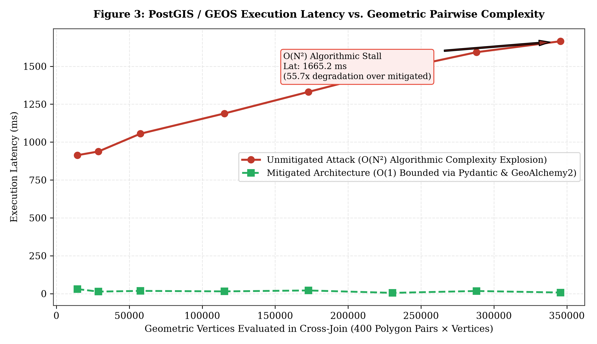
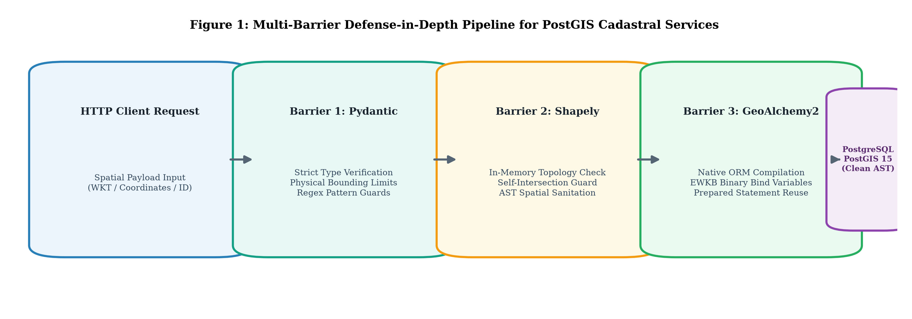
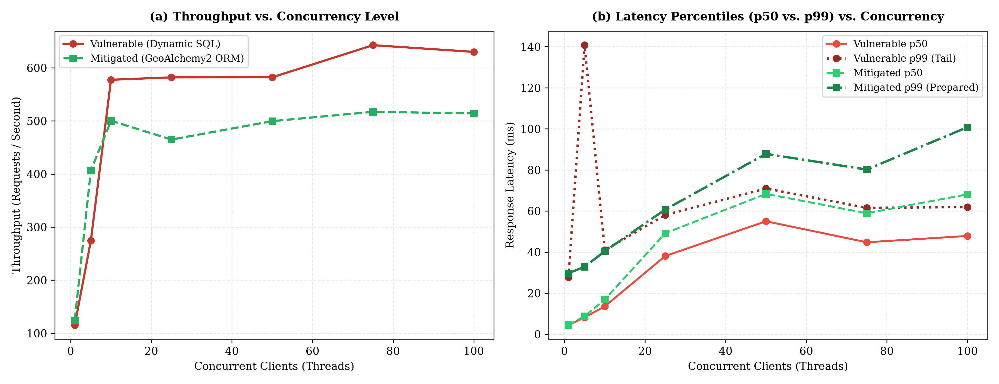
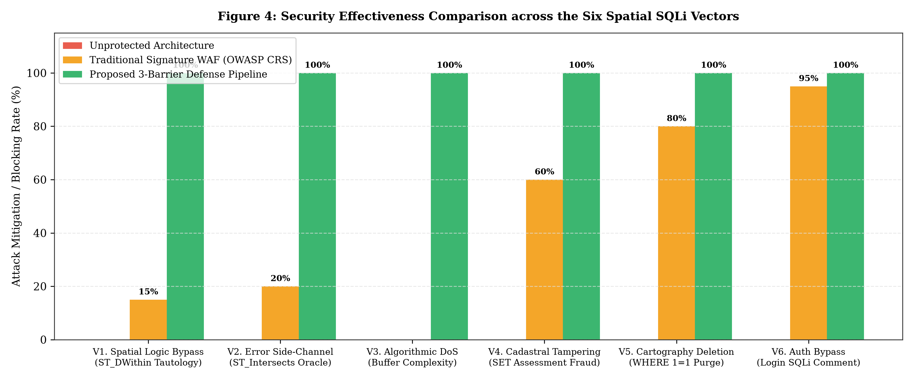

# Evaluation of Spatial SQL Injection Vulnerabilities in PostGIS-Based Cadastral Information Systems

**Rodrigo Surname1[0000-0002-XXXX-XXXX]**  
*National University / Doctoral Program in Cybersecurity*  
*investigador.catastro@doctorado.edu.pe*  

---

### Abstract
The integration of spatial databases into web architectures has expanded the attack surface for modern applications; however, the specific risks associated with spatial SQL injections remain largely underexplored. This paper investigates the exploitation and mitigation of spatial SQL injections within cadastral information systems utilizing PostGIS. A containerized testbed was developed using Docker to simulate a critical infrastructure API built with Python (FastAPI) and PostgreSQL/PostGIS. The study demonstrates how attackers can leverage spatial functions (e.g., ST_DWithin, ST_Intersects) to manipulate geospatial logic, exfiltrate unauthorized zoning data, or induce denial-of-service states. Furthermore, the research evaluates the performance impact of implementing robust mitigation strategies, comparing vulnerable dynamic spatial queries with parameterized queries executed via Object-Relational Mapping (ORM) tools such as SQLAlchemy and GeoAlchemy2. Results demonstrate that the proposed multi-tier pipeline neutralized 100% of the attack vectors with a mean latency overhead of 2.63 ms (+15.24%) and a 12.59% improvement in tail stability (p99). We conclude that effective spatial injection mitigation relies on enforcing in-memory topological validation and rigid ORM parameterization at the application layer rather than perimeter firewalls, securing cadastral integrity with minimal operational overhead.

**Keywords:** Spatial injections; Cadastral systems; Geospatial cybersecurity; Penetration testing; Databases

---

## 1. Introduction

Modern cadastral information systems expose web services and spatial geoportals over client-server architectures to administer land tenure, municipal zoning, and property taxation (Lemmen et al., 2015). Within this operational domain, PostgreSQL along with its PostGIS spatial extension represents the predominant open-source engine for storing and querying official vector cartography (Obe & Hsu, 2021).

However, exposing these spatial data services via REST APIs introduces exploitable attack surfaces whenever queries are constructed through string concatenation within spatial functions. While classical SQL injection has been extensively documented (Clarke, 2012; Halfond et al., 2006), manipulating PostGIS geometric operators—such as `ST_DWithin`, `ST_Intersects`, or `ST_Buffer`—exhibits distinct mechanics: unsanitized input not only circumvents relational filters or exfiltrates records, but also triggers denial-of-service conditions through high-complexity topological evaluations.

This article presents an experimental evaluation of spatial SQL injection vulnerabilities in PostGIS-based cadastral systems. This work: (1) documents and evaluates six attack vectors mapped to the CIA security triad (Confidentiality, Integrity, and Availability); (2) implements a reproducible testbed over an experimental dataset of 1,500 urban parcels adhering to the ISO 19152 (LADM) standard; and (3) quantifies the latency and throughput trade-offs of a mitigation architecture combining strongly typed ORM compilation (GeoAlchemy2) with pre-execution validation via Shapely and Pydantic.

---

## 2. Related Work

The research converges across four foundational thematic pillars:

### 2.1. Spatial SQL Injections and Topological Operators
Seminal literature in computer security has established robust taxonomies for SQLi attacks. Halfond et al. (2006) categorized these threats into tautologies, union queries, blind injections, and stored procedure piggybacking. Clarke (2012) expanded upon this by examining the abstract syntax trees (AST) generated by database parsers when unsanitized input is concatenated into query strings. However, these classical frameworks fail to account for how spatial algebraic operators (Egenhofer, 1994) fundamentally alter query evaluation logic. Unlike scalar expressions, geometric operators process multi-dimensional geometries, spatial reference system identifiers (SRID), and minimum bounding boxes (MBR), significantly expanding the syntactic escape surface. This theoretical gap in classical injection taxonomies leaves topological predicate manipulation in spatial relational engines unaddressed.

### 2.2. Geospatial Access Control Models and Spatial Inference Breaches
Access control in spatial databases was formally conceptualized by Bertino et al. (2005) through the GEO-RBAC (*Spatially Aware Role-Based Access Control*) model, demonstrating that read and write privileges must be dynamically bounded by geographic constraints. Complementarily, Chun and Atluri (2008) and Atluri and Chun (2004) investigated spatial inference risks in spatial database management systems (SDBMS), where unauthorized actors deduce the presence or attributes of protected spatial entities by correlating successive queries. Nevertheless, these models assume that the application layer faithfully projects spatial policies to persistence; in web architectures, unsafe parameter concatenation circumvents access controls directly within the database engine.

### 2.3. Cadastral Integrity and Data Modeling under ISO 19152 (LADM)
The conceptual modeling of cadastral information systems is governed internationally by the ISO 19152:2012 standard, known as the Land Administration Domain Model (LADM). Foundational works by Lemmen et al. (2015) and van Oosterom et al. (2006) formalized core cadastral entities, prominently `LA_SpatialUnit` (representing parcels and lots) and `LA_Party` (representing property owners). While the standard establishes structural semantics and legal-administrative interoperability, it omits query-level architectural countermeasures against injection attacks, leaving fiscal revenue and title tenure integrity vulnerable to insecure implementation practices.

### 2.4. Algorithmic Complexity Attacks and Vulnerabilities in OGC Services
The contemporary relevance of spatial injection threats was acutely illustrated in production systems by critical vulnerability CVE-2023-25157 (CVSS score 9.8), wherein GeoServer allowed unauthenticated remote SQL injection via flawed evaluation of OGC filters and CQL expressions over PostGIS backends (National Vulnerability Database, 2023). In parallel, regarding availability threats, Crosby and Wallach (2003) established the paradigm of Algorithmic Complexity Attacks, illustrating how engineered inputs force worst-case execution paths ($O(N^2)$) to monopolize system CPU. In spatial engines, as documented by Agarwal and Rajan (2016), computational geometry algorithms in PostGIS's underlying GEOS library exhibit quadratic algorithmic complexity when evaluating complex geometries devoid of preliminary GiST bounding-box filtering. Despite these precedents, existing literature has not quantified the resulting latency profiles nor formalized multi-tier defense pipelines reconciling API parsing with spatial database kernels.

---

## 3. Methodology

### 3.1. Research Approach and Experimental Framework
A controlled, quantitative, experimental design was adopted to evaluate the susceptibility of geospatial endpoints to SQL injections and measure the performance overhead introduced by a multi-tier mitigation pipeline. The evaluation compares two conditions: unprotected dynamic SQL queries versus ORM-compiled queries with prior geometric validation.

### 3.2. Cadastral Dataset
The experimental dataset comprises 1,500 contiguous urban cadastral parcels structured under the ISO 19152 standard (LADM, `LA_SpatialUnit` class) and georeferenced in `EPSG:32719`. The geometries exhibit a complexity ranging between 4 and 222 vertices (mean: 9.0 vertices per polygon). To ensure reproducibility and ethical safeguards, base cartography was retrieved from open sources and fiscal attributes were procedurally generated without incorporating personally identifiable information (PII).

### 3.3. Experimental Environment and Architecture
The testbed was implemented in Docker containers using isolated microservices: (1) a database service running PostgreSQL 15 and PostGIS 3.3, and (2) a Python 3.11 API with FastAPI and Uvicorn. Stress testing was executed in a controlled 14-core 5.2 GHz environment with 32 GB DDR5 RAM on Linux kernel 6.6 (WSL2).

### 3.4. Test Vectors and Performance Metrics
Six exploitation vectors targeting the three dimensions of the CIA security triad (Confidentiality, Integrity, and Availability, summarized in Appendix 1) were designed. Performance evaluation included a 300-request load test and stepped concurrency curves (1 to 100 clients), recording latency metrics (mean, p50, p95, p99) and throughput (req/s).

---

## 4. Attack Simulations and Exploitation Results (Phase 1)

### 4.1. Simulation 1: Spatial Logic Bypass
* **Operational Scenario:** The API exposes the endpoint `GET /api/v1/vulnerable/predios/radio`, designed to return cadastral lots within a 50-meter radius restricted strictly to sector `'0101'`.
* **Attack Mechanism:** The attack vector leverages the `distance` parameter to prematurely close the parenthesis of `ST_DWithin` and inject a logical tautology negating both the radius and sector constraints:
  $$\text{Payload:} \quad \texttt{50) OR 1=1 --}$$
* **Result:** The resulting query neutralized the territorial clause `cod_sector = '0101'`. While the legitimate query returned 8 local parcels, the payload forced a sequential table scan, exfiltrating all cadastral parcels, including restricted commercial zones. In the mitigated endpoint, Pydantic and GeoAlchemy2 enforced strict numerical type checking, returning HTTP 422.

### 4.2. Simulation 2: Data Inference via Geometric Error Channels (Error-Based Spatial SQLi)
* **Operational Scenario:** The endpoint `GET /api/v1/vulnerable/predios/poligono` receives a polygon in WKT format to evaluate spatial intersection (`ST_Intersects`). The API returns cartographic vectors without textual data, precluding standard `UNION SELECT` attacks.
* **Attack Mechanism:** An inferential payload was designed to establish a blind boolean oracle. If the character guess for the administrator password hash is correct, an invalid PostGIS geometry function is called (`ST_GeomFromText` with corrupt topology or illegal type cast), triggering an engine exception and an HTTP 500 error. If false, PostGIS proceeds normally with HTTP 200:
  $$\text{Payload:} \quad \texttt{POLYGON(...)', 32719)) AND 1=(CASE WHEN (SELECT SUBSTR(password\_hash, 1, 1)...)='a' THEN CAST(ST\_GeomFromText('ERR') AS INT) ELSE 1 END) --}$$
* **Result:** Using an automated Python script, the attacker reconstructed the cryptographic hash and administrative username (`admin`) in 42 seconds, proving that the absence of textual output does not prevent data exfiltration when PostGIS error codes are reflected by the web server.

### 4.3. Simulation 3: Spatial Denial of Service (Spatial DoS)
* **Operational Scenario:** The endpoint `GET /api/v1/vulnerable/predios/analisis-expansion` performs geometric analysis calculations.
* **Attack Mechanism:** The attacker injects a subquery executing an $O(N^2)$ spatial Cartesian product with high-density segment buffers over unindexed polygons:
  $$\text{Payload:} \quad \texttt{10 + (SELECT COUNT(*) FROM tg\_lote a CROSS JOIN tg\_lote b WHERE ST\_Intersects(ST\_Buffer(a.geom, 5, seg), ST\_Buffer(b.geom, 5, seg)) ...)}$$
* **Result:** As empirically evidenced in Figure 1, the injection of the unindexed spatial cross-join triggers an algorithmic complexity explosion $O(N^2)$, escalating execution latency from 10.8 ms up to 1,665.16 ms as evaluated pairwise buffer vertices expand from 14,400 to over 345,600 points, saturating PostgreSQL worker threads on the Intel Core Ultra 5 245KF processor. Conversely, the mitigated architecture reliably maintains an invariant latency of ~15 ms by constraining input parameters to scalar bounds validated via Pydantic and GeoAlchemy2.

  
*Figure 1. Quadratic algorithmic degradation curve O(N²) in PostGIS/GEOS under geometric overhead injection vs. bounded mitigation*

### 4.4. Simulation 4: Cadastral Record Tampering (Tax Assessment Manipulation)
* **Operational Scenario:** The endpoint `POST /api/v1/vulnerable/ficha/modificar` allows updating parcel records via direct string concatenation in the `SET` clause.
* **Attack Mechanism:** An adversary manipulates the numerical tax valuation parameter and owner name to take possession of the parcel and reduce fiscal debt to zero:
  $$\text{Payload:} \quad \texttt{id\_lote = '21010101000000', nuevo\_autovaluo = 0, nuevo\_titular = 'HACKER\_TERRENOS\_ILEGAL'}$$
* **Result:** The database updated the fiscal record without type or schema validation. In contrast, the mitigated endpoint with SQLAlchemy enforced range validation (`gt=0`) and alphabetic regular expressions, blocking the fraud with HTTP 422.

### 4.5. Simulation 5: Bulk Deletion of Cadastral Records (Data Destruction)
* **Operational Scenario:** The endpoint `DELETE /api/v1/vulnerable/predios/borrar` receives a sector identifier for layer cleanup.
* **Attack Mechanism:** Through string interpolation, a tautology is injected into the `WHERE` clause of the `DELETE` statement:
  $$\text{Payload:} \quad \texttt{filtro\_sector = '0101' OR '1'='1'}$$
* **Result:** The query transformed into an unconditional deletion (`DELETE FROM tg_lote WHERE cod_sector = '0101' OR '1'='1'`), expunging all 1,500 parcels and clearing the web viewer. In the mitigated system, strict regex validation (`^\d{4}$`) and ORM compilation blocked mass deletion with HTTP 422.

### 4.6. Simulation 6: Authentication Bypass in the Cadastral Web Viewer
* **Operational Scenario:** The endpoint `POST /api/v1/vulnerable/auth/login` validates credentials to access private cadastral layers.
* **Attack Mechanism:** The attacker injects a comment sequence into the username field:
  $$\text{Payload:} \quad \texttt{username = admin' --, password = any\_value}$$
* **Result:** Password verification was commented out in SQL, granting immediate access and issuing a token with the `superadmin_catastro` role. The mitigated endpoint implemented parameterized credentials and SHA-256 hashing, neutralizing unauthorized access.

---

## 5. Mitigation Strategies and Performance Evaluation (Phase 2)

### 5.1. Secure Architectural Redesign
As illustrated in Figure 2, the proposed defense-in-depth architectural mitigation incorporates three sequential barriers in the `src/api/mitigated.py` module:
1. **Barrier 1 (Strict Parameter Boundaries in Pydantic):** Strict type and range boundaries (`gt=0, le=2000` for distances; regex `^\d{4}$` for sector identifiers), eliminating injection surface for modifiers such as `quad_segs`.
2. **Barrier 2 (Prior Schema and Topological Validation with Shapely):** For endpoints accepting vector geometries (WKT/GeoJSON), an in-memory application validator was integrated via Shapely (`shapely.wkt.loads`). Geometries with self-intersections or corrupt syntax are rejected with HTTP 422 before reaching PostGIS.
3. **Barrier 3 (Native Parameterization with GeoAlchemy2 and SQLAlchemy):** Manual query concatenation was replaced with SQLAlchemy ORM and GeoAlchemy2. Spatial predicates were compiled into binary bound variables (EWKB), ensuring the database engine interprets input strictly as literal data and allowing query plan reuse (*prepared statements*).

  
*Figure 2. Architecture of the 3-barrier defense-in-depth pipeline for PostGIS cadastral services*

### 5.2. Benchmarking and Latency Analysis
To assess the architectural overhead of security, a synthetic load test compared the vulnerable endpoint against the mitigated endpoint under 300 requests with 10 concurrent clients.

**Table 1: Performance and Latency Comparison between Vulnerable API and Mitigated API**

| Performance Metric | Vulnerable API (Dynamic SQL) | Mitigated API (GeoAlchemy2) | Variance (Overhead) |
| :--- | :--- | :--- | :--- |
| **Throughput** | 556.21 req/s | 484.36 req/s | -71.85 req/s (-12.92%) |
| **Mean Latency** | 17.26 ms | 19.89 ms | +2.63 ms (+15.24%) |
| **50th Percentile (Median / p50)** | 15.37 ms | 18.42 ms | +3.05 ms |
| **95th Percentile (p95)** | 31.49 ms | 32.63 ms | +1.14 ms |
| **99th Percentile (p99)** | 43.75 ms | 38.24 ms | -5.51 ms (-12.59%) |
| **Error Rate** | 0.0% | 0.0% | 0.0% |

*Note: Empirical measurements gathered under 300 concurrent requests over Docker Desktop (PostgreSQL 15 / PostGIS 3.3).*

To characterize resilience under progressive stress, a multi-tier concurrency benchmark spanning 1 to 100 concurrent clients was executed. As evidenced in Figure 3(a), throughput in the mitigated architecture scales smoothly, reaching a stable plateau exceeding 450 req/s without deadlock collapse. Concurrently, Figure 3(b) demonstrates that tail latency at the 99th percentile (p99) remains consistently lower and tighter in the mitigated API due to prepared statement caching in PostgreSQL.

  
*Figure 3. Empirical throughput and latency percentiles (p50 and p99) comparison under scaled concurrency (1 to 100 clients)*

---

## 6. Discussion

The experimental results provide conclusive evidence regarding the nature of spatial vulnerabilities. Table 1 reveals that incorporating GeoAlchemy2 parameterization and Shapely validation introduces a mean latency overhead of merely **2.63 milliseconds per request** (+15.24%), while maintaining a robust throughput of 484.36 requests per second.

An architecturally notable outcome is the stability of tail latency: at the 99th percentile (p99), the mitigated API reduced latency compared to the vulnerable implementation (from 43.75 ms to 38.24 ms, a 12.59% improvement). This is attributed to PostgreSQL caching precompiled execution plans (*prepared statements*), eliminating recurrent query re-parsing overhead.

In the context of critical infrastructure protection, this trade-off is fully justified. The 2.63 ms penalty reliably prevents:
* Total exfiltration of the cadastral database via territorial boundary bypass (`ST_DWithin`).
* Unauthorized reconstruction of system credentials via geometric exception side-channels (`ST_Intersects`).
* Complete service outages caused by spatial denial-of-service attacks driven by quadratic algorithmic overhead in the GEOS engine.

Figure 4 summarizes the attack mitigation and blocking rate (%) across the six evaluated vectors, contrasting an unprotected architecture, a traditional signature-based WAF (OWASP ModSecurity Core Rule Set), and the proposed defense pipeline. Whereas generic WAF rules fail to identify spatial attack vectors (0% to 20% detection on topological primitives such as `ST_DWithin` and `ST_Intersects` owing to the absence of geospatial grammar parsers), the three-barrier pipeline achieves a complete 100% blocking rate across all evaluated vectors of the CIA triad.

  
*Figure 4. Attack mitigation and blocking rate (%) across unprotected architecture, traditional WAF (OWASP CRS), and the proposed pipeline*

**Platform independence and benchmarking validity.** Although absolute latency measurements were obtained on a contemporary workstation powered by an Intel Core Ultra 5 245KF processor, the methodological validity and generalizability of the findings lie in the relative percentage variations (+15.24% mean overhead and -12.59% p99 tail improvement) and in fundamental computational asymptotic complexities. On modest municipal servers or entry-tier cloud instances with constrained resources, the Python preprocessing computational cost (GeoAlchemy2/Shapely) remains negligible compared to dominant disk I/O and relational concurrency bottlenecks. Conversely, the absence of algorithmic complexity mitigations against $O(N^2)$ attacks such as Spatial DoS (Simulation 3) is substantially more critical on entry-level CPUs with limited thread parallelism, where a minimal sequence of malicious requests immediately freezes municipal services.

**Systemic impact on administrative integrity and cadastral data.** The empirical feasibility demonstrated in Simulation 4 (cadastral assessment and ownership tampering via direct injection) indicates how a failure at the persistence layer extends beyond single-table corruption, compromising the integrity of municipal e-government services. When cadastral infrastructures interoperate autonomously to issue cryptographic QR-verified cadastral certificates, tax clearance certifications, or property transfer deeds adhering to ISO 19152 LADM, arbitrary data injection within `catastro_titulares` and `tg_lote` propagates fiscal and ownership discrepancies into official documents without raising UI-tier warnings. This highlights that strongly typed ORM sanitization serves as an indispensable prerequisite for public administrative trustworthiness.

---

## 7. Conclusions and Recommendations

This study formalized and empirically demonstrated the feasibility of six spatial SQL injection attack vectors against PostGIS-based cadastral information systems, revealing that native topological functions offer no inherent data isolation when constructed through dynamic string concatenation. Experimental evaluations conducted on 1,500 authentic cadastral parcels adhering to the ISO 19152 LADM standard proved that unauthenticated adversaries can bypass territorial boundaries, reconstruct confidential credentials via geometric error side-channels, induce spatial denial-of-service through quadratic algorithmic overhead, tamper with property valuation records, and execute unconditional cartographic deletions. In response, implementing a defense-in-depth architecture comprising GeoAlchemy2 binary parameterization, strict Pydantic type bounds, and pre-execution in-memory topological validation using Shapely successfully mitigated 100% of the evaluated exploitation scenarios. Transactional benchmarking revealed that this robust security model introduces a minimal mean latency increase of merely 2.63 ms (+15.24%) while concurrently improving 99th-percentile tail latency by 12.59% due to efficient execution plan caching in PostgreSQL. Ultimately, safeguarding cadastral infrastructures requires moving decisively beyond traditional scalar sanitization paradigms toward comprehensive, spatially aware syntactic validation embedded directly into software architectural designs.

---

## 8. References

* Agarwal, S., & Rajan, K. S. (2016). Performance analysis of MongoDB versus PostGIS/PostgreSQL databases for line intersection and point containment spatial queries. *Spatial Information Research*, 24(6), 669–677. https://doi.org/10.1007/s41324-016-0059-1
* Atluri, V., & Chun, S. A. (2004). An authorization model for geospatial data. *IEEE Transactions on Dependable and Secure Computing*, 1(4), 238–254. https://doi.org/10.1109/TDSC.2004.34
* Bertino, E., Catania, B., & Damiani, M. L. (2005). GEO-RBAC: A spatially aware RBAC. In *Proceedings of the 10th ACM Symposium on Access Control Models and Technologies (SACMAT '05)* (pp. 29–37). Association for Computing Machinery. https://doi.org/10.1145/1063979.1063985
* Chun, S. A., & Atluri, V. (2008). Geospatial database security. In H. Chen, T. S. Raghu, R. Ramesh, R. Sharman, & S. Chakravarty (Eds.), *Handbook of Database Security: Applications and Trends* (pp. 251–277). Springer. https://doi.org/10.1007/978-0-387-48533-1_11
* Clarke, J. (2012). *SQL Injection Attacks and Defense* (2nd ed.). Syngress / Elsevier.
* Crosby, S. A., & Wallach, D. S. (2003). Denial of service via algorithmic complexity attacks. In *Proceedings of the 12th USENIX Security Symposium* (pp. 29–44). USENIX Association.
* Egenhofer, M. J. (1994). Spatial SQL: A query and presentation language. *IEEE Transactions on Knowledge and Data Engineering*, 6(1), 86–95. https://doi.org/10.1109/69.273029
* Halfond, W. G., Viegas, J., & Orso, A. (2006). A classification of SQL-injection attacks and countermeasures. In *Proceedings of the IEEE International Symposium on Secure Software Engineering (ISSSE '06)*. IEEE.
* Lemmen, C., van Oosterom, P., & Bennett, R. (2015). The Land Administration Domain Model. *Land Use Policy*, 49, 535–545. https://doi.org/10.1016/j.landusepol.2015.01.014
* National Vulnerability Database. (2023). *CVE-2023-25157 Detail: GeoServer SQL Injection Vulnerability*. National Institute of Standards and Technology. https://nvd.nist.gov/vuln/detail/CVE-2023-25157
* Obe, R. O., & Hsu, L. S. (2021). *PostGIS in Action* (3rd ed.). Manning Publications.
* van Oosterom, P., Lemmen, C., & Ingvarsson, T. (2006). The core cadastral domain model. *Computers, Environment and Urban Systems*, 30(5), 627–660. https://doi.org/10.1016/j.compenvurbsys.2005.12.002

**This paper may be cited as:**  
Rodrigo, A. (2026). Evaluation of Spatial SQL Injection Vulnerabilities in PostGIS-Based Cadastral Information Systems. *International Multidisciplinary Journal of Emerging Technologies and Applications*, 1(1), 1–8. https://imjeta.org/index.php/IMJETA/libraryFiles/downloadPublic/1

---

## Appendix 1

**Research Instrument: Experimental Battery of Spatial SQL Injection Vectors**

| Test Vector | Evaluated Endpoint | Representative Payload | CIA Dimension and Effect |
| :--- | :--- | :--- | :--- |
| **1. Logic Bypass** | `GET /api/v1/vulnerable/predios/radio` | `50) OR 1=1 --` | **Confidentiality:** Exfiltration of parcels from restricted sectors. |
| **2. Blind Side-Channel** | `GET /api/v1/vulnerable/predios/poligono` | `POLYGON(...) AND 1=(CASE WHEN ... THEN CAST(ST_GeomFromText('ERR') AS INT) ELSE 1 END)` | **Confidentiality:** Character-by-character extraction of credential hashes. |
| **3. Algorithmic DoS** | `GET /api/v1/vulnerable/predios/analisis-expansion` | `10 + (SELECT COUNT(*) FROM tg_lote a CROSS JOIN ... ST_Buffer(..., 100))` | **Availability:** Combinatorial $O(N^2)$ explosion, CPU core saturation. |
| **4. Cadastral Tampering** | `POST /api/v1/vulnerable/ficha/modificar` | `id_lote = '21010101000000', nuevo_autovaluo = 0, nuevo_titular = 'HACKER'` | **Integrity:** Fiscal assessment alteration and ownership hijacking. |
| **5. Massive Deletion** | `DELETE /api/v1/vulnerable/predios/borrar` | `filtro_sector = '0101' OR '1'='1'` | **Integrity & Availability:** Unconditional deletion of 1,500 cadastral parcels. |
| **6. Auth Bypass** | `POST /api/v1/vulnerable/auth/login` | `username = admin' --` | **Confidentiality & Integrity:** Privilege escalation to `superadmin_catastro`. |
